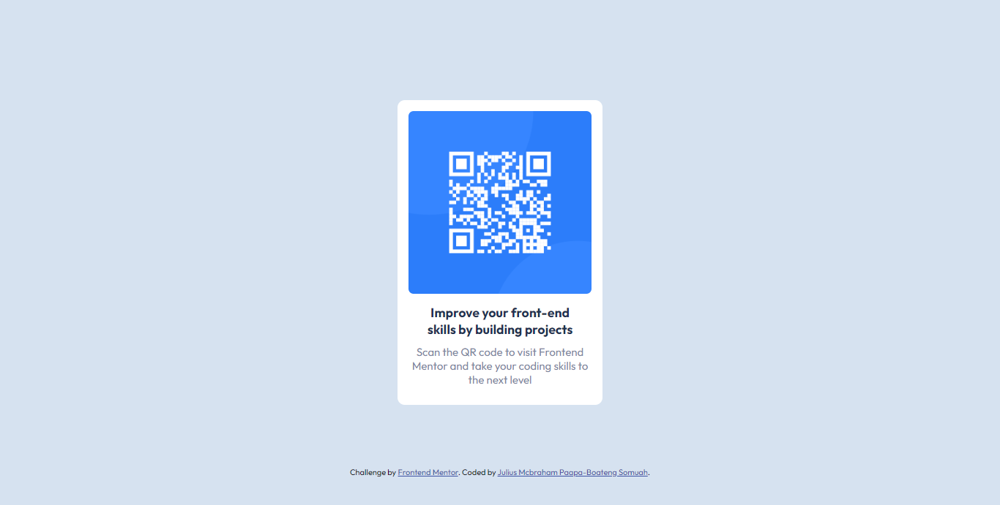

# Frontend Mentor - QR code component solution

This is a solution to the [QR code component challenge on Frontend Mentor](https://www.frontendmentor.io/challenges/qr-code-component-iux_sIO_H). Frontend Mentor challenges help you improve your coding skills by building realistic projects.

## Table of contents

- [Frontend Mentor - QR code component solution](#frontend-mentor---qr-code-component-solution)
  - [Table of contents](#table-of-contents)
    - [Screenshot](#screenshot)
    - [Links](#links)
    - [Built with](#built-with)
  - [Author](#author)

**Note: Delete this note and update the table of contents based on what sections you keep.**

### Screenshot

### Links

- Solution URL: [https://your-solution-url.com](https://github.com/khophisnow/QR-code-component.git)
- Live Site URL: [Add live site URL here](https://khophisnow.github.io/QR-code-component/)

### Built with

- Semantic HTML5 markup
- CSS custom properties
- Flexbox
**Note: These are just examples. Delete this note and replace the list above with your own choices**

## Author

- Frontend Mentor - [@khophisnow](https://www.frontendmentor.io/profile/khophisnow)
- Twitter - [@khophi_snow](https://www.twitter.com/khophi_snow)
